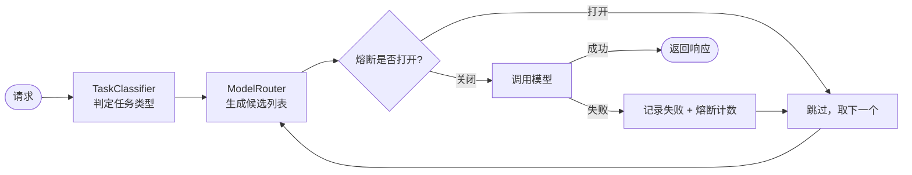

# model-router-in-action · 多模型路由与故障转移

> 配套文章：篇7《别把 Agent 绑死在一个模型上：Spring AI Alibaba 多模型路由与故障转移实战》

## ✨ 这个仓库演示什么

1. **多模型 Bean 配置**：Qwen（主力）/ DeepSeek（推理）/ Qwen-Turbo（兜底）
2. **ModelRouter 路由层**：自己也实现 `ChatModel` 接口，对上层完全透明，业务代码零改动
3. **3 种路由策略**：按任务 / 按成本 / 按可用性，可组合
4. **故障转移三件套**：超时 + 按模型维度熔断 + 线程池隔离
5. **Higress AI 网关配置**：统一 OpenAI 协议、自动 fallback、Token 计量

## 📁 结构

```
src/main/java/com/javaai/router/
├── ModelRouterApplication.java        # 主类
├── config/ChatModelConfig.java        # 多模型 Bean 配置
├── router/
│   ├── ModelRouter.java               # 路由核心（implements ChatModel）
│   ├── TaskClassifier.java            # 任务分类（决定候选模型池）
│   └── ModelCircuitBreaker.java       # 按模型维度的熔断器
└── api/ChatController.java            # 演示入口
docs/higress-ai-proxy.yaml              # Higress AI 网关配置
docs/architecture.mmd                   # 架构流程图（Mermaid）
```

## 🚀 快速开始

```bash
export DASHSCOPE_API_KEY=sk-xxx
export DEEPSEEK_API_KEY=sk-xxx
mvn spring-boot:run
```

调用：

```bash
curl -X POST localhost:8080/api/chat \
  -H 'Content-Type: application/json' \
  -d '{"message":"帮我推导一下这个算法的复杂度"}'
```

## 🧠 3 种路由策略

| 策略 | 怎么路由 | 适用场景 |
|---|---|---|
| **按任务路由** | 推理 → 强模型；对话 → 通用模型；向量 → 专用模型 | 任务类型清晰 |
| **按成本路由** | 简单任务 → 小模型；高价值任务 → 旗舰模型 | 成本敏感 |
| **按可用性路由** | 主模型挂了 → 秒切备用 | 可用性要求高 |

路由的产物不是一个模型，而是**一个按优先级排好序的候选列表**——这决定了能不能做故障转移。

## 🔁 路由与故障转移流程



## ⚙️ 四个关键设计

1. **`ModelRouter implements ChatModel`**：路由层对上层透明，业务代码一行不改
2. **返回候选列表而非单模型**：天然支持「失败就切下一个」
3. **熔断判断前置**：已挂的模型直接跳过，**不浪费一次超时**
4. **熔断按模型维度隔离**：区分「某模型挂了」和「我们网络挂了」，只切那一个

## 📊 收益（上线 3 个月）

| 指标 | 之前 | 之后 | 变化 |
|---|---|---|---|
| 服务可用性 | 99.5% | 99.95% | 故障时长 ↓ 90% |
| 综合 Token 成本 | 基准 | — | ↓ 35% |
| 故障恢复时间 | 人工介入 10+ 分钟 | 自动切换 < 1 秒 | ↓ 99% |

## ⚠️ 踩坑清单

| # | 坑 | 后果 | 解法 |
|---|---|---|---|
| 1 | 不做超时 | 慢响应拖垮线程池 | 连接 3s / 读取 20s 硬超时 |
| 2 | 熔断不前置 | 每次都白白等一次超时 | 调用前先判熔断状态 |
| 3 | 不同模型消息格式硬转 | 报错 / 丢信息 | 统一走 Spring AI 的 Prompt 抽象 |
| 4 | 路由策略写死 | 改策略要发版 | 策略配置化（Nacos） |
| 5 | 不过灰度就全量切 | 新模型出事全站挂 | 先 5% 流量 |
| 6 | 忽略 Token 计量 | 月底账单吓人 | 网关统一计量 |
| 7 | 密钥硬编码 | 泄露风险 | KMS / 环境变量 |
| 8 | 只降级不回归 | 质量悄悄下降没人知 | 降级配套评测集 |

## 📚 参考

- [Spring AI 官方文档](https://docs.spring.io/spring-ai/reference/)
- [Higress AI 网关](https://higress.cn/docs/latest/plugins/ai-proxy/)
- [Spring AI Alibaba](https://java2ai.com/)

## License

MIT

> 版本说明：本仓库基于 Spring AI Alibaba 1.0 GA 与 Higress 2.x 编写，具体 API 与版本号以官方仓库为准。

---

## 📮 关注公众号「Java程序员面试宝典」


**微信搜一搜「Java程序员面试宝典」**，或直接扫码关注。

- 📖 **「Java AI 实战派」系列 10 篇长文** —— 公众号首发，不定时更新
- 🧰 每篇都配**可运行的开源仓库**（这套系列一共 8 个仓库）
- 🕳️ 只讲**踩过的坑**，不讲空概念

> 这个仓库帮到你了吗？点个 ⭐ **Star** 支持一下，再去公众号坐坐 👆
